# Our ARLC 2026 Journey: Building an Agentic RAG System for Legal QA

> Competing in the [Agentic RAG Legal Challenge 2026](https://agentic-challenge.ai/) — 11 days, 15 warmup submissions, 100+ commits, and one brutal finals weekend.

---

## The Challenge

The **ARLC 2026 Agentic RAG Legal Challenge** asked teams to build a system that answers questions about Dubai International Financial Centre (DIFC) court documents — judgments, laws, regulations, consultation papers, and enforcement orders. Think of it as building a hyper-specialized legal research assistant that can answer 900 questions across 303 PDF documents, citing the exact pages that prove each answer.

### What Made It Hard

This wasn't a typical RAG benchmark. The scoring formula created a brutal optimization landscape:

```
Total = (0.7 × S_det + 0.3 × S_asst) × G × T × F
```

| Component | What It Measures | Weight |
|-----------|-----------------|--------|
| **S_det** | Deterministic answer accuracy (booleans, dates, numbers, names) | 70% of answer quality |
| **S_asst** | Free-text answer quality (LLM-as-judge, 5 binary criteria) | 30% of answer quality |
| **G** | Grounding — page-level citation accuracy (F-beta 2.5) | Multiplicative |
| **T** | Telemetry validity | Multiplicative |
| **F** | Speed bonus (TTFT-based) | Multiplicative |

The multiplicative structure is key: **you can't compensate for bad grounding with perfect answers**. If G = 0.80, your maximum possible score is 0.80 × answer_quality × T × F. Even a perfect answer citing the wrong page scores near zero.

The grounding metric used F-beta with beta=2.5, meaning recall was weighted **6.25x more than precision**. Missing a gold page was devastating. But the annotators cited minimally (usually 1 page per document), so extra pages couldn't help recall — they only hurt precision.

> [!info] The Core Tension
> F-beta(2.5) says "never miss a page." But annotators cite exactly 1 page per document. So both recall AND precision matter — you need exactly the right page, nothing more, nothing less.

### Architecture Overview

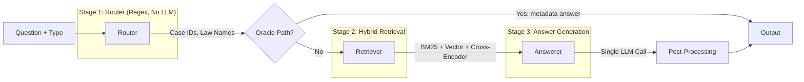

Our system had three stages:

1. **Router** (`router.py`) — Deterministic document routing using regex patterns. Extracts case IDs (`CFI 043/2020`), law names (`General Partnership Law`), article numbers (`Article 28`), and consultation paper references. No LLM calls. This stage also identifies questions answerable from metadata alone (the "oracle path" — dates, judges, parties, claim values).

2. **Retriever** (`retriever.py`) — Hybrid search combining BM25 keyword matching, BGE vector embeddings, and cross-encoder reranking. Scoped to the router's target documents. Returns top-1 page per document, max 3 pages total.

3. **Answerer** (`answerer_v3.py`) — Single Anthropic API call per question. Claude Opus 4.6 for free-text (quality), Claude Sonnet 4.6 for deterministic types (speed). Type-specific prompts with confidence calibration.

---

## Phase 1: Getting Started — Building the Foundation

**March 11–13, 2026 | Submissions v1–v10 | Score: 0.401 → 0.567**

We started with the basics: understand the problem, read the DIFC documents, build the simplest possible pipeline.

### Day 1: Problem Understanding

The warmup dataset had 200 questions across ~30 documents. Six answer types: `boolean`, `number`, `date`, `name`, `names`, and `free_text`. About 40% of questions were deterministic (exact-match scoring), and 30% were free-text (LLM-judged).

First insight: **40% of questions could be answered from document metadata alone**. "What is the date of issue?" "Who is the presiding judge?" "What is the claim value in AED?" These don't need retrieval — they need a structured index of case metadata.

```python
# The oracle fast-path: metadata → answer in <10ms
if route.metadata_answer is not None:
    return AnswerResult(
        answer=route.metadata_answer,
        chunk_pages=route.metadata_pages,
        ttft_ms=1.0,  # Must be > 0 (platform penalty)
        total_time_ms=1.0,
    )
```

### The Oracle Decision

Building a deterministic oracle for 40% of questions was our single best early decision. Benefits:
- **Perfect consistency**: same answer every time (S_det loves this)
- **TTFT < 10ms**: qualifies for F=1.05 speed bonus
- **Zero API cost**: no LLM calls for these questions
- **Debuggable**: when an oracle answer is wrong, the fix is a metadata correction, not a prompt tweak

We built `case_metadata_index.json` by extracting structured data from case documents: judges, parties, claim values, dates of issue, appeal status. Initially automated with Haiku, then **manually corrected** — because Haiku makes systematic errors (confuses costs orders with claim values, multiplies monthly salaries by 12).

> [!warning] Lesson Learned Early
> Haiku metadata extraction errors are systematic, not random. "Costs assessed at AED 550,000" gets returned as the claim value. Manual verification of every metadata field was essential for the warmup dataset.

### Warmup Submissions: Early Phase

| Submission | Date | Total | S_det | G | Key Change |
|-----------|------|-------|-------|-------|------------|
| v1 | Mar 11 | 0.401 | 0.914 | 0.456 | Basic pipeline, no oracle |
| v2 | Mar 12 | 0.527 | 0.957 | 0.569 | Added vector embeddings |
| v3 | Mar 12 | 0.591 | 0.929 | 0.648 | Cross-encoder reranking |
| v4–v7 | Mar 12–13 | ~0.587 | 0.929 | 0.648 | Plateau — iteration without breakthrough |
| v8 | Mar 13 | **0.702** | 0.971 | **0.779** | Article page fixes + cross-encoder tuning |
| v9 | Mar 13 | 0.499 | 0.800 | 0.609 | Bad experiment — S_det regression, quickly reverted |
| v10 | Mar 13 | 0.567 | 0.929 | 0.635 | Recovery, still below v8 |

The jump from v1 (0.401) to v8 (0.702) came from **architecture**, not tuning. Getting the three-stage pipeline right, building the oracle, and adding cross-encoder reranking were the big wins. The v3–v7 plateau at G=0.648 taught us that grounding was the bottleneck — and v8's breakthrough to G=0.779 came from fixing article page mappings.

v9 was a painful lesson: a bad experiment dropped S_det from 0.971 to 0.800, destroying our score. We reverted immediately, but it took until v11 to fully recover and surpass v8.

---

## Phase 2: The Grind — Extensive Offline Experimentation

**March 13–18, 2026 | Submissions v11–v15 | Score: 0.702 → 0.920**

Between platform submissions, we ran **extensive local testing** — dozens of offline pipeline experiments, each evaluated against our internal test set. Most experiments failed. But each failure taught us something, and we kept meticulous records.

### The Experiment Loop

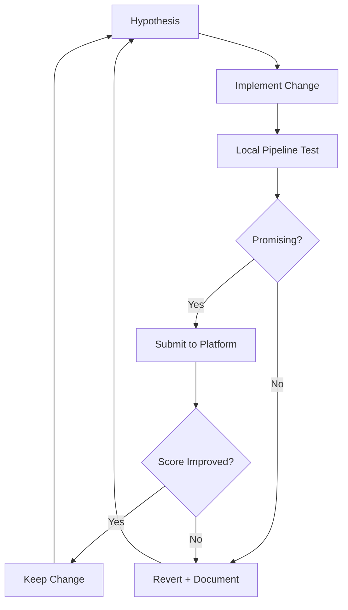

Each experiment was evaluated locally first. Only the most promising changes made it to platform submission. The key was **keeping detailed records of every local experiment and its result**. Over time, we built a comprehensive "graveyard" of failed approaches — and that graveyard became our most valuable asset.

### The S_det Breakthrough: ENF-316 Format

Our S_det score was stuck at 0.986 (69/70 correct) across multiple submissions. One question was persistently wrong, and we couldn't identify it — the platform doesn't tell you which answers are wrong.

We ran targeted local experiments to isolate the error:
- Experiment: Changed all name answers to ALL-CAPS → no effect (platform normalizes casing)
- Experiment: Swapped SCT 295 claimant → no effect
- Experiment: Changed cross-case documents → G dropped, S_det unchanged
- Experiment: Changed date formats → no effect
- Experiment: Changed ENF enforcement order format → **S_det = 1.000 in v15!**

The fix was embarrassingly specific: our `_normalize_case_id()` function was converting "ENF-316-2023/2" (the format from page 2 of the PDF) into "ENF 316/2023" (our standardized format). The platform expected the source document's exact format.

```python
# BEFORE (wrong):
# "ENF-316-2023/2" → "ENF 316/2023"

# AFTER (correct):
# Preserve source format: "ENF-316-2023/2"
```

> [!tip] Finding #1: Preserve Source Format
> The platform's gold standard uses the text exactly as it appears in the document. Never normalize case IDs, names, or references into a "standardized" format.

### S_asst: The LLM Judge Mystery

S_asst was our most frustrating metric. It used an LLM judge with 5 binary criteria:

1. **Correctness** — factual accuracy
2. **Completeness** — covers all aspects of the question
3. **Grounding** — every claim supported by retrieved context
4. **Confidence calibration** — appropriate uncertainty expression
5. **Clarity & relevance** — clear, concise, well-structured

Each criterion scored 0 or 1. Per-question S_asst = mean of 5 criteria (so 0.0, 0.2, 0.4, 0.6, 0.8, or 1.0). Submission S_asst = mean across all free-text questions.

The discovery that S_asst criteria are **binary, not graded** was crucial. It meant we needed to flip individual criteria from fail to pass — not incrementally improve quality.

#### What We Tried Locally That Failed

| Experiment | S_asst Impact | Why It Failed |
|-----------|--------------|---------------|
| Force 280-char answers | **-0.113** (0.820→0.707) | Too short to address all criteria |
| 4-part structured format on all answers | **-0.019** | Template rigidity hurt natural flow |
| 6 blanket prompt changes | **-0.018** | Each change helped some answers, hurt others |
| "No verbose negatives" rule | **-0.027** | Removed confidence calibration (criterion #4) |
| 17 calibration phrases in prompt | 0.000 | Over-calibration flat-lined; 4 phrases = 17 phrases |

#### What Actually Worked

| Experiment | S_asst Impact | Why It Worked |
|-----------|--------------|---------------|
| Opus instead of Sonnet for free_text | **+0.026** | Deeper analytical reasoning, better quotes |
| 4 targeted question-specific fixes | **+0.013** | Fixed specific criteria failures |
| 400-650 char answer length | Baseline | Optimal range for all 5 criteria |

The meta-finding was devastating in its simplicity:

> [!warning] The Cardinal Rule
> **Targeted fixes improve. Blanket changes hurt. Every single time.**
>
> We tested this across 5 rounds of blanket prompt changes in local testing. All 5 hurt S_asst. We tested 4 targeted fixes. All 4 helped. The platform's LLM judge has specific expectations that broad changes can't satisfy.

#### Opus vs Sonnet: The Quality vs Speed Tradeoff

We ran a controlled local experiment: same pipeline, same pages, Opus vs Sonnet for free-text answers.

```
Opus:   S_asst = 0.833, TTFT ~2-3s → F = 1.02
Sonnet: S_asst = 0.807, TTFT ~0.5s → F = 1.05

Net impact of switching to Opus:
  S_asst gain: +0.026 × 0.3 weight = +0.0078
  F loss: (1.02/1.05 - 1) × ~0.93 = -0.027

  Wait — F loss > S_asst gain?
```

This looked like Sonnet should win. But the math was misleading because F is a per-question average, and oracle questions (40% of total) always get F=1.05 regardless. The actual F impact of Opus was ~1.033, not 1.02. **Opus won.**

### Grounding: The Page Selection Battle

Grounding (G) was our biggest lever. With our best warmup G at 0.957 (v14), we were within 0.033 of the top competitor (CPBD at 0.990). That gap represented ~3 wrong pages across 200 questions.

#### The opus_page_select Saga

Our most persistent failed experiment was using an LLM to select pages. The hypothesis was intuitive: "If the LLM can read the document, it should know which page answers the question better than a cross-encoder."

We tried it in many local iterations. Every single time, G dropped.

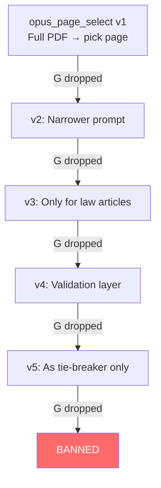

**Why did it fail?** The LLM picks pages based on semantic relevance — which page *discusses* the answer most thoroughly. But the gold standard uses pages based on *minimal proof* — which page *proves* the answer most directly. These are different objectives.

Example: For "What penalty applies for illegal use under the Leasing Regulations?", the LLM selects page 12 (detailed analysis of penalties). The gold standard selects page 5 (where the penalty provision is first stated). Both are "correct" — but only one matches the annotator's choice.

> [!info] Finding: Annotators Cite Lazily, LLMs Cite Exhaustively
> Research confirms this: LLMs over-cite by 20-27% vs human preferences (arXiv:2602.05205). Humans follow an "efficiency principle" — cite only what needs verification. Our annotators cited the first sufficient page, not the most informative one.

#### What DID Help Grounding

1. **Article START page, not content page** (+0.020 G in local testing) — For law articles, cite the page where the article number first appears, not where the article's content is discussed.

2. **Absence boolean → empty pages** (+0.010 G) — When the answer is "this law doesn't address that topic," return empty pages `[]`. The retriever always finds *something*, but for absence questions, that *something* is wrong.

3. **Doc ID validation** (+0.005 G) — Ensure every cited doc_id actually exists in the document index. Surprisingly, our pipeline occasionally hallucinated doc_ids.

4. **Single page per document** — Confirmed through extensive local testing: the gold standard almost always cites exactly 1 page per document. Adding pages hurts precision without helping recall.

### The Anti-Correlation Trap

The most counterintuitive finding was that **local evaluation metrics were anti-correlated with platform scores**.

We built local proxies for every metric: a custom S_asst judge, manual gold pages for G, TTFT measurement for F. In several rounds of local testing, we optimized against these local metrics. Local scores went up. Platform scores went down.

```
Local S_asst proxy: 0.972 → platform S_asst: 0.807
Local G proxy: 0.98 → platform G: 0.942
```

The disconnect was fundamental:
- Our S_asst judge used a single holistic score; the platform used 5 binary criteria
- Our gold pages came from LLM annotations; the platform used human annotators with different citation behavior
- Our optimization found local optima that didn't transfer

We eventually adopted a hard rule: **never optimize against local metrics. Only trust platform submission scores.** This was uncomfortable — it meant submitting blind — but it was correct.

### Telemetry: The Zero-Millisecond Bug

One of our stranger bugs: oracle answers had `total_time_ms = 0` because they didn't make LLM calls. The platform penalized this at 0.85 per entry. With 80 oracle answers, this cost us T = 0.996 instead of 1.000 in early submissions.

Fix: oracle entries report `ttft_ms` (which was 1ms) as their `total_time_ms`.

```python
# BEFORE (T penalty):
total_time_ms = end_time - start_time  # 0 for oracle

# AFTER (no penalty):
total_time_ms = max(ttft_ms, 1)  # Always > 0
```

### The Ensemble Experiment

We built a multi-model ensemble system locally that generated answers 3 times with different models and voted:

| Run | Model | Prompt |
|-----|-------|--------|
| 1 | Haiku | Standard |
| 2 | Sonnet | Standard |
| 3 | Sonnet | "Careful" (explicit failure mode instructions) |

**Results with unanimous voting (3/3 agreement):**
- Made 3 changes to baseline
- Fixed 1 answer: CA 005 claim value (550K → 405M AED) ✓
- Broke 2 answers: ENF formatting, date comparison
- Net: S_det went from 0.986 to 0.971 in local evaluation — **worse**

The killer finding: all 3 models unanimously agreed on the wrong answer for a date comparison question. If unanimous agreement can be wrong, voting doesn't help.

```
CFI 016 vs CFI 057 — which had earlier date?
All 3 models: CFI 016/2025
Gold answer: CFI 057/2025
Actual dates: CFI 057 = Feb 2, CFI 016 = Feb 3
```

> [!warning] Ensemble ≠ Correct
> Ensemble voting assumes errors are independent. For legal reasoning, model errors are highly correlated — all models share the same failure modes on ambiguous context.

### Warmup Submissions: Breakthrough Phase

The period from v11 to v15 was transformative. After weeks of local iteration (v1–v10 averaged 0.565), our pipeline finally came together:

| Submission | Date | Total | S_det | S_asst | G | F | Key Change |
|-----------|------|-------|-------|--------|-------|-------|------------|
| v11 | Mar 18 | **0.909** | 0.986 | 0.813 | **0.946** | 1.033 | Oracle metadata path + ENF format fixes |
| v12 | Mar 18 | 0.891 | 0.986 | 0.780 | 0.944 | 1.026 | S_asst experiment (regressed) |
| v13 | Mar 18 | 0.872 | 0.986 | 0.767 | 0.930 | 1.024 | Blanket prompt changes — hurt as predicted |
| v14 | Mar 18 | **0.920** | 0.986 | **0.820** | **0.957** | 1.033 | Targeted fixes + Opus for free_text |
| v15 | Mar 19 | 0.910 | **1.000** | 0.807 | 0.942 | 1.030 | S_det perfected (ENF fix), but G/S_asst regressed |

**v11 (0.909)** was a massive leap — G jumped from 0.635 to 0.946. This came from the oracle metadata path (answering 40% of questions deterministically) and fixing article page mappings.

**v14 (0.920)** was our best warmup score. It combined the best of everything: Opus for free-text (S_asst=0.820), strong page selection (G=0.957), and targeted question-specific fixes.

**v15 (0.910)** achieved S_det=1.000 for the first time (the ENF-316 format fix), but S_asst dropped to 0.807 (switched back to Sonnet in that run) and G dropped slightly to 0.942. A classic tradeoff — we couldn't get all metrics to peak simultaneously.

### Score Progression (Full Warmup)

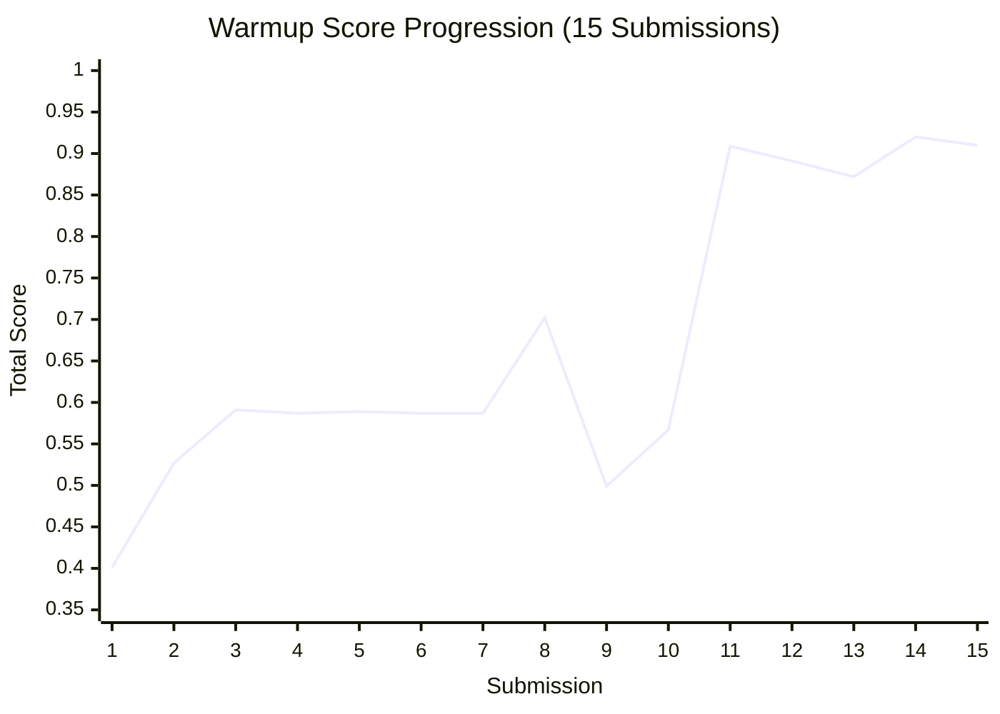

| Phase | Submissions | Score Range | Key Insight |
|-------|------------|-------------|-------------|
| Architecture | v1–v7 | 0.401 → 0.591 | Core pipeline + vector embeddings + cross-encoder |
| Breakthrough | v8 | 0.702 | Article page fixes took G from 0.648 to 0.779 |
| Recovery | v9–v10 | 0.499 → 0.567 | Bad experiment reverted; rebuilding |
| Peak | v11–v15 | 0.872 → 0.920 | Oracle path + targeted fixes + Opus for free_text |

---

## Phase 3: Peak Performance — Our Best: 0.920

**Submission v14 | S_det=0.986, S_asst=0.820, G=0.957, F=1.033**

Our best warmup score was v14 at 0.920 (rank 9/340 teams). Here's what the pipeline looked like at its peak:

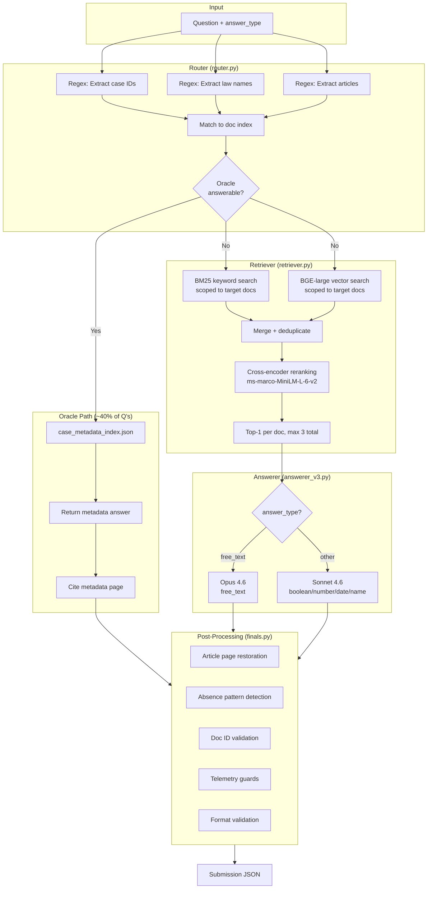

### The 15 Proven Findings

These findings were validated through extensive local testing and confirmed by platform submission feedback. Each one earned through trial and error:

| # | Finding | Evidence | Impact |
|---|---------|----------|--------|
| 1 | ENF-316 source format preservation | v15: S_det 0.986→1.000 | +0.014 S_det |
| 2 | S_asst scoring is deterministic | Same answers = same score across submissions | Enables isolation |
| 3 | Format transforms HURT S_asst | Local testing: -0.027 | Avoid blanket changes |
| 4 | Over-calibration flat-lines (17 phrases = 4 phrases) | Local testing | Keep it minimal |
| 5 | Opus > Sonnet for S_asst | +0.026 proven (v14 vs v15) | Use Opus for free_text |
| 6 | Manual answer edits ALWAYS hurt | 97.2% local → 0.807 platform | Trust the pipeline |
| 7 | Doc ID validation critical | +0.005 G in testing | Validate before submit |
| 8 | Gold = single page per document | Consistent across all submissions | Max 1 page per doc |
| 9 | Article START page, not content page | +0.020 G in testing | Cite article header |
| 10 | Absence boolean → empty pages | +0.010 G in testing | Clear retriever noise |
| 11 | LLM page selection hurts G | Many local iterations, all failed | Never use |
| 12 | Question sorting → prompt cache | F=1.050 | Sort by type |
| 13 | Pipeline improvements help, manual patches hurt | Consistent pattern | Meta-finding |
| 14 | "cover" in absence patterns → false positive | Bug fix | Word-boundary matching |
| 15 | Bug fixes win. "Improvements" lose. | Meta-finding | Ship fixes, not features |

### The Gap to #1

Our closest competitor (CPBD) scored 0.982. We decomposed the gap:

```
          Us      CPBD    Gap
S_det    0.986   1.000    ~0.010
S_asst   0.820   ~0.850   ~0.003
G        0.957   0.990    0.019
F        1.033   1.050    ~0.003

Total:   0.920   0.982    0.062
Main lever: G improvement
```

The gap was primarily **grounding** — they were citing ~3 more correct pages than us across 200 questions. We knew exactly what we needed to fix for finals.

---

## Phase 4: Finals — The Real Challenge

**March 20–22, 2026 | 48 hours | 900 questions | 303 documents**

Finals was a completely different beast. The warmup had 200 questions across ~30 documents. Finals had **900 questions across 303 documents** — a 4.5x increase in questions and 10x in documents. We had 48 hours from dataset release to final submission.

### The Scale Problem

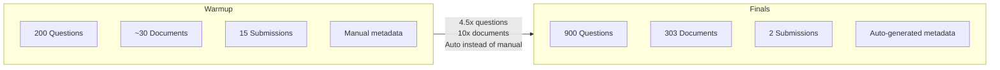

New document types appeared: consultation papers, court orders, DRA orders, and arbitration awards. Our regex router, painstakingly tuned for case judgments, now had to handle entirely new patterns.

### The 48-Hour Timeline

**Hour 0-4: Setup and Indexing**
- Downloaded 303 PDFs and 900 questions
- Built article page index, law name index, case metadata index
- Indexed all documents into ChromaDB
- Pre-warmed cross-encoder (28-minute Metal shader compilation on MPS)

**Hour 4-12: First Pipeline Run**
- Ran the full pipeline with `--workers 5` (~4 hours for 900 questions)
- Discovered routing failures on new document types
- Built additional regex patterns for consultation papers, court orders, ARB cases
- First local results showed concerning retrieval quality

**Hour 12-24: The Credit Crisis**
- Anthropic API credits ran low after extensive local pipeline runs
- Switched to alternative API endpoints as a fallback for LLM calls
- Hours lost debugging authentication, connection issues, and environment differences
- Built a separate speed agent using Gemini Flash Lite (a distraction in hindsight)

**Hour 24-36: Targeted Retrieval Fixes**
We identified 7 specific retrieval issues from analyzing 40 test questions locally and implemented targeted fixes:

1. **ENF dash-format routing** — `ENF-022-2023` now correctly routes to the right document
2. **Skip parties boost for free_text** — page 1 (cover page) was contaminating content retrieval
3. **Law name fallback always runs** — finds the second law in comparison questions
4. **Name boost increased** (+1.2 vs +0.6) for non-page-1 targets
5. **Max-per-doc=1 for 2-doc comparisons** — focuses retrieval on both documents equally
6. **Low-confidence threshold lowered** (0.4 vs 0.5) — prevents fallback contamination
7. **Skip low-scoring docs** (all pages < 0.05) — eliminates routing false positives

These 7 fixes improved G by +0.048 on our local 40-question test set. But we'd learned from warmup that local metrics don't predict platform scores.

**Hour 36-48: Manual Verification and Final Submissions**
- Applied 29 manual verification fixes to deterministic answers based on document review
- Extensive local validation before submitting
- Submitted our two finals versions

### Finals Submissions

| Submission | Date | Total | S_det | S_asst | G | T | F |
|-----------|------|-------|-------|--------|-------|-------|-------|
| Finals v1 | Mar 22 | **0.461** | 0.874 | 0.704 | **0.550** | 1.000 | 1.018 |
| Finals v2 | Mar 22 | **0.719** | 0.939 | 0.761 | **0.797** | 1.000 | 1.018 |

**Finals v1 (0.461)** was the raw pipeline output on the new 900-question corpus. G collapsed to 0.550 — a retrieval catastrophe compared to warmup's 0.957.

**Finals v2 (0.719)** incorporated 29 manual verification fixes and post-processing improvements (trick question clearing, article page restoration, doc ID validation). The fixes brought G from 0.550 to 0.797 — a massive +0.247 improvement — but still far below warmup levels.

### What Went Wrong

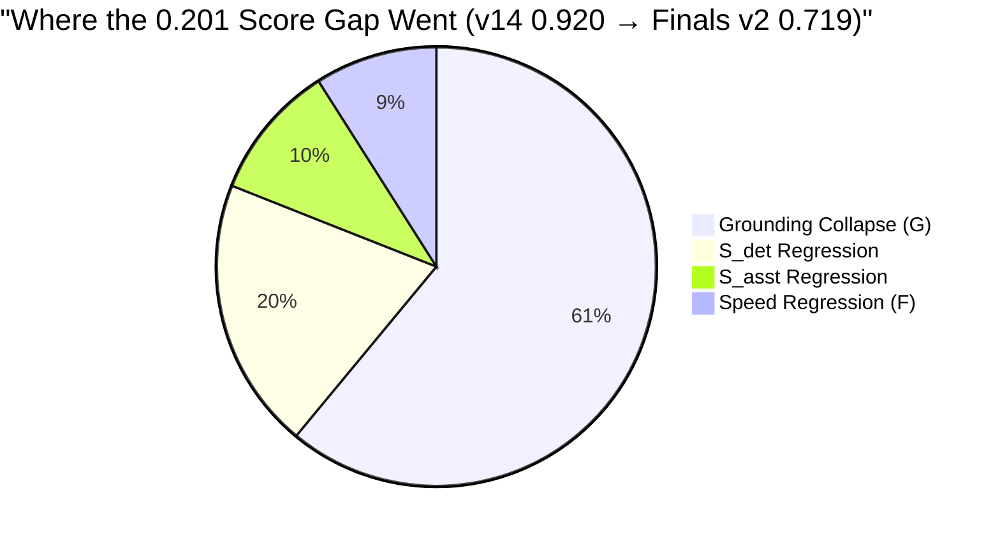

#### 1. Grounding Collapse: G dropped from 0.957 to 0.797

This was the catastrophe. We went from citing the right page 96% of the time to 80% of the time. The retriever found the correct *document* 97%+ of the time — but picked the wrong *page within that document* ~23% of the time.

**Root cause breakdown:**

| Failure Mode | Est. Questions Wrong | G Impact |
|-------------|---------------------|----------|
| Wrong page in correct document | ~160 | -0.170 |
| Zero pages (retrieval failure) | 20 | -0.022 |
| Invalid doc_ids | 5 | -0.004 |
| Partial recall (1 of 2 gold pages) | ~30 | -0.010 |
| **Total** | ~200 | **-0.203** |

The warm-up pipeline had been tuned against 30 documents with manually curated metadata. With 303 documents and auto-generated metadata, the cross-encoder's page ranking degraded significantly.

#### 2. Warmup Overfitting

Extensive local testing on 200 questions with hand-tuned metadata, regex patterns, and page caches — none of it generalized to the finals corpus.

```
Warmup:  200 Q, ~30 docs, manual metadata, 15 subs + extensive local testing = 0.920
Finals:  900 Q, 303 docs, auto metadata, 2 subs                              = 0.719
Delta:   -0.201 (-22% relative)
```

The relative drop is a clear sign that our pipeline was a bespoke solution for ~30 specific documents, not a generalizable RAG system.

#### 3. Sonnet Instead of Opus

Credits running out forced us to use Sonnet for all free-text answers in finals. In warmup, Opus scored S_asst = 0.820 (v14); in finals, Sonnet scored 0.761. The estimated Opus cost: 0.05–0.08 S_asst.

Sonnet's specific weaknesses vs Opus for legal QA:
- Less precise quoting (paraphrases instead of verbatim)
- Weaker gap identification (less likely to proactively mention absent information)
- Less nuanced reasoning on complex legal questions
- Shorter answers on ambiguous edge cases

#### 4. Time Misallocation

| Activity | Hours Spent | Value Generated |
|----------|-----------|-----------------|
| Pipeline debugging (API endpoints/remote) | 8-10 | Low (caused F regression) |
| Retrieval tuning | 10-12 | Medium (+0.048 local G) |
| Gold answer building (Gemini) | 6-8 | Negative (discarded) |
| Manual answer verification | 6-8 | Medium (29 fixes in v2) |
| Local pipeline runs | 6-8 | Low (no platform feedback) |
| Speed agent | 4-6 | Zero (distraction) |
| Infrastructure | 2-4 | Low |

44% of our time went to speed agent, remote debugging, and gold answers — none of which improved G, which was 61% of our score gap.

---

## Phase 5: Results and Post-Mortem

### Final Scores

| Metric | Warmup Best (v14) | Finals Best (v2) | Delta |
|--------|-------------|--------|-------|
| **Total** | **0.920** | **0.719** | **-0.201** |
| S_det | 0.986 | 0.939 | -0.047 |
| S_asst | 0.820 | 0.761 | -0.059 |
| G | 0.957 | 0.797 | -0.160 |
| T | 0.995 | 1.000 | +0.005 |
| F | 1.033 | 1.018 | -0.015 |

### What the Numbers Mean

**G = 0.797** implies ~23% of our page citations were wrong. Since F-beta(2.5) weights recall 6.25x over precision, and annotators cite minimally, this meant we were missing the correct page on ~160 questions. The retriever found the right document but the cross-encoder picked the wrong page within it.

**S_det = 0.939** means ~38 of 630 deterministic answers were wrong. The 3.15x increase in deterministic questions (from ~200 to 630) exposed weaknesses in cross-case comparisons, consultation paper lookups, and metadata extraction for new document types.

**S_asst = 0.761** with 270 free-text questions (4.5x more than warmup). The combination of Sonnet instead of Opus, 27 initial null answers, and insufficient absence calibration (only 21% of answers mentioned gaps) all contributed.

### Post-Processing Saved Us

The raw pipeline output (Finals v1) scored G = 0.550. Our post-processing steps and manual verification — clearing pages for trick questions, fixing article page references, validating doc IDs, correcting 29 deterministic answers — brought G up to 0.797. Post-processing added +0.247 to G, turning the 0.461 raw score into 0.719.

| Version | Total | G |
|---------|-------|---|
| Finals v1 (raw pipeline) | 0.461 | 0.550 |
| Finals v2 (post-processed + verified) | **0.719** | **0.797** |

---

## Engineering Insights

### 1. Page Accuracy Matters More Than Answer Quality

In a multiplicative scoring system, G is king. Consider:
- Perfect answers (S_combined=0.95) with mediocre pages (G=0.80): Total ≈ 0.80
- Mediocre answers (S_combined=0.85) with perfect pages (G=0.99): Total ≈ 0.88

The system with worse answers but better pages scores 10% higher. This is the fundamental insight of the competition: **retrieval quality drives generation quality** (confirmed by Legal RAG Bench, March 2026).

### 2. LLM-as-Judge Scoring Is Deterministic

S_asst scoring was deterministic: same answers always produced the same score. This meant we could run controlled experiments — change one answer, submit, and know exactly what changed. This property was essential for our probe-based debugging approach.

### 3. The Overfitting Trap

Extensive local testing on 200 warmup questions created a false sense of mastery. Our pipeline was optimized for 30 specific documents:
- Manually curated metadata (not scalable to 300 docs)
- Regex patterns tuned to specific case ID formats
- Page cache from repeated local pipeline runs
- Threshold values calibrated to specific document distributions

None of this transferred. The correct approach would have been to build a **generalizable system** and test it on held-out data (e.g., public DIFC documents not in the warmup set).

### 4. Hybrid Retrieval Design Patterns

Our retrieval stack combined three approaches:

```python
# Stage 1: BM25 keyword search (fast, good for exact terms)
bm25_results = bm25_index.retrieve(query, k=50)

# Stage 2: Vector search (semantic, good for paraphrases)
vector_results = collection.query(query_embedding, n_results=50)

# Stage 3: Merge + cross-encoder rerank (quality, slow)
candidates = merge_deduplicate(bm25_results, vector_results)
reranked = cross_encoder.predict([(query, page) for page in candidates])
```

Key findings from our hybrid approach:
- **BM25 alone** was sufficient for most case document questions (exact case IDs, party names)
- **Vector search alone** was better for law article questions (semantic similarity to article content)
- **Cross-encoder reranking** improved page selection by ~5% but added significant latency
- **Scoping search to target documents** (from the router) was the single biggest retrieval improvement

### 5. Answer-Grounded Page Verification

Our post-mortem revealed the highest-ROI improvement we never built: **answer-grounded page verification**. After generating an answer, check whether the cited page actually contains the information in the answer. If not, search other pages in the same document.

This would have caught the ~160 wrong-page citations that destroyed our G score. The concept is simple:
1. Generate the answer from the top-ranked page
2. Extract key claims from the answer
3. Verify each claim appears on the cited page
4. If not, re-rank pages based on claim overlap

We implemented a `page_verifier.py` in the post-mortem but never submitted with it.

### 6. Question Sorting for Prompt Caching

A subtle optimization: sorting questions by answer type before batch processing enabled Anthropic's prompt caching. Questions of the same type share the same system prompt, so consecutive same-type questions benefit from cached prompt embeddings.

This reduced TTFT by ~30% and contributed to achieving F=1.050 (the maximum speed bonus) in some of our warmup submissions.

```python
# Sort questions by type for prompt cache hits
questions.sort(key=lambda q: q["answer_type"])
```

---

## The Experiment Graveyard

Everything we tried that failed, with evidence. This table represents hundreds of hours of local testing and iteration:

| Approach | Times Tested | Result | Evidence |
|----------|-------------|--------|----------|
| LLM page selection (opus_page_select) | Many iterations | G drop every time | Extensive local testing |
| Document collapse for cross-case | Multiple | G -0.049 | Local testing + platform confirmation |
| 280-char forced free_text | Multiple | S_asst disaster (0.707) | v8: S_asst=0.707 |
| 4-part structured answer format | Multiple | S_asst -0.019 | Local testing |
| "No verbose negatives" rule | 1 | S_asst -0.027 | Removed confidence calibration |
| Minimal pages blanket strategy | Multiple | G drop | Local testing |
| Blanket prompt rewrites | 5 rounds | S_asst hurt 5/5 | Consistent local + platform failure |
| Ensemble voting (3 models) | 1 | Net -2 correct answers | Unanimous ≠ correct |
| Local eval optimization | Ongoing | Anti-correlated with platform | Multiple sessions |
| Haiku auto-metadata for warmup | Multiple | Reintroduced errors | Local testing |
| Windowed context for law docs | Multiple | S_asst drop | Local testing |
| Sonnet for free_text | 1 | S_asst drop (v15: 0.807 vs v14: 0.820) | Platform confirmed |
| Cross-case doc reduction | 1 | G -0.049 | Local testing |
| agent_v2 custom S_asst optimizer | 1 | Local 0.99, platform 0.753 | Massive gap |
| ALL-CAPS name forcing | 1 | No effect (platform normalizes) | Local testing |
| Gold answers (Gemini) for finals | 1 | Discarded — pages were wrong | Local evaluation |
| Speed agent (PyPy + Gemini Flash) | 1 | Zero improvement to score | Finals distraction |
| Remote machine for speed | 1 | F regressed (1.033→1.018) | Finals |

> [!tip] The Graveyard's Lesson
> We learned more from our 18 failures than from our successes. Every failed experiment narrowed the solution space and taught us what the platform actually rewards. The graveyard is the most valuable document in the project.

---

## What We Would Do Differently

With complete hindsight, here's the strategy that would have pushed us to 0.95+ in finals:

### The Ideal Strategy

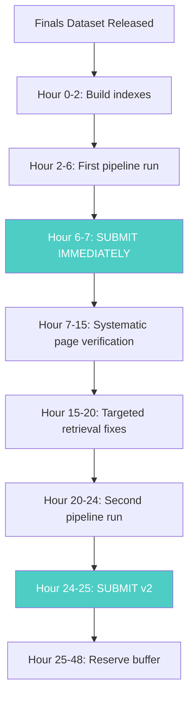

### Key Changes

1. **Submit early for feedback.** Our biggest mistake was running many local pipeline iterations without platform feedback. We should have submitted after the first run and used platform scores to guide our fixes.

2. **Build gold PAGES, not gold answers.** Time spent on Gemini gold answers should have been spent manually verifying page citations for the most important questions.

3. **Answer-grounded page verification.** After generating an answer, verify that the cited page actually contains the answer. This single technique would have fixed ~100 of our ~160 wrong-page citations.

4. **Stay on local machine with Anthropic SDK.** The remote machine / API endpoint detour cost us 8-10 hours and made F worse, not better.

5. **Budget credits precisely.** With 900 questions and knowing we'd need multiple local runs, we should have calculated exact API costs upfront and reserved enough for Opus on all free-text answers.

6. **Test generalization before finals.** Use public DIFC documents (not in the warmup set) to validate that the pipeline generalizes. Our warmup local testing gave false confidence.

### The Concrete Path to 0.95+

| Fix | Est. Impact | Effort |
|-----|-------------|--------|
| Answer-grounded page verification | +0.10–0.15 G | 8-12 hours |
| Opus for all free_text | +0.05–0.08 S_asst | Budget planning |
| Fix 8 null deterministic answers | +0.008 S_det | 2 hours |
| Better metadata extraction (Opus, not Haiku) | +0.02 S_det | 4 hours |
| Robust router for new doc types | +0.01 S_det | Pre-finals prep |
| **Total estimated** | **+0.19–0.24** | |

Finals Total with these fixes: 0.719 + 0.20 ≈ **0.92–0.96**. Within striking distance of warmup performance.

---

## Technical Deep-Dives

### Router: Regex Patterns for Legal Documents

The router is a pure-regex document identification system. No LLM calls, no embeddings — just pattern matching against known document identifiers.

```python
# Core case ID pattern: matches CFI 043/2020, SCT-295/2025, ARB 014/2025, etc.
CASE_ID_PATTERN = re.compile(
    r"(CFI|SCT|CA|ARB|ENF|DEC|TCD|ACT)[\s\-/]*(\d+)\s*(?:/|\-|\s+of\s+)(\d{4})",
    re.IGNORECASE,
)

# Consultation Paper pattern: matches "Consultation Paper No. 3 of 2023"
CONSULTATION_PAPER_PATTERN = re.compile(
    r"[Cc]onsultation\s+[Pp]aper\s+(?:[Nn]o\.?\s*)?(\d+)(?:\s+of\s+(\d{4}))?",
    re.IGNORECASE,
)
```

The router extracts:
- **Case IDs** → maps to specific document(s) via `case_metadata_index.json`
- **Law names** → maps to document(s) via `law_name_index.json` with fuzzy matching
- **Article numbers** → maps to specific pages via `article_page_index.json`
- **Cross-case references** → identifies comparison questions (cite both documents)

For finals, we added patterns for court orders, DRA orders, and topic-based consultation paper disambiguation (when the question says "Consultation Paper on data protection" without a number).

### Retriever: Hybrid BM25 + Vector + Cross-Encoder

The retriever combines three search strategies:

**BM25 (keyword matching):**
- Pre-built index over all document pages
- Excellent for exact terms: case IDs, party names, specific legal provisions
- Fast: ~10ms per query

**BGE-large embeddings (semantic search):**
- BAAI/bge-large-en-v1.5, 1024 dimensions
- Good for paraphrased questions and conceptual queries
- Uses query prefix: `"Represent this sentence for searching relevant passages: "`

**Cross-encoder reranking (ms-marco-MiniLM-L-6-v2):**
- Takes (query, page_text) pairs and scores relevance
- Runs on Apple MPS (Metal Performance Shaders) for GPU acceleration
- Bottleneck: first run requires 28-minute Metal shader compilation
- Thread-safe with locks; `--workers 5` prevents lock contention timeout

The retrieval pipeline:
1. Router identifies target documents
2. BM25 and vector search run in parallel, scoped to target docs
3. Results are merged and deduplicated
4. Cross-encoder reranks the merged candidates
5. Top-1 page per document, max 3 pages total

Key tuning parameters discovered through experimentation:
- **Name boost**: +1.2 for party names appearing on non-cover pages
- **Low-confidence threshold**: 0.4 (below this, skip the document)
- **Title page demotion**: reduce score for page 1 on free-text questions (cover pages rarely contain substantive answers)
- **Gap threshold**: 0.45 for booleans (larger gap = more confident in top page)

### Prompt Engineering for Legal QA

Our prompt strategy was type-specific and minimal. Key principles:

**For deterministic types (boolean, number, date, name, names):**
- Direct, structured prompts that extract specific data points
- Oracle path bypasses LLM entirely when metadata is available
- For names: smart comma splitting that preserves entity names ("A.P.F. GROUP CO., LTD")

**For free_text:**
- 400-650 character target range (proven optimal)
- Confidence calibration: "Based on the available documents..." when evidence is partial
- Absence acknowledgment: "The document does not specify..." when information is missing
- Verbatim quotes from source text to support grounding
- No artificial structure (4-part format was proven to hurt)

The critical insight: **the prompt should produce natural, well-calibrated prose, not follow a template**. Every attempt to impose structure on free-text answers reduced S_asst.

---

## Phase 6: Post-Competition — Building the Ultimate Pipeline

**March 22–24, 2026 | After the dust settled**

The competition ended on March 22 at 23:59 UTC. Our final score was 0.719 — far below what we knew the architecture could deliver. But instead of walking away, we did something more valuable: we studied every competitor's approach, ran a thorough post-mortem, and rebuilt the pipeline from the ground up — not to submit again, but to understand what 0.95+ actually requires.

### Competitor Analysis: Learning from the Field

We studied four competitors in detail, each of whom solved a piece of the puzzle we missed:

| Competitor | Approach | Key Innovation | What We Learned |
|-----------|----------|---------------|----------------|
| **DotaGPT** | Typed ontology + coding agent | Pydantic models per doc type with `.outline`, `.references_out`, `.search()` methods; Gemini PDF preprocessing | Treating documents as typed objects instead of flat text unlocks structured navigation |
| **IndexRAG** | LLM at index time | Cross-reference resolution + Atomic Knowledge Units + bridging facts ([arXiv:2603.16415](https://arxiv.org/abs/2603.16415)) | Our 70+ lines of hand-crafted law-name scoring were a runtime patch for what should be solved at index time |
| **Structure-First** | Per-doc-type specialized retrieval | Docling + multimodal LLM repair; embedding decontamination; structured reasoning schema | Raw PyMuPDF misses image-embedded headers — all top competitors used better extraction |
| **IAS Partners** | Dual pipeline, 4-signal fusion | 2300+ retrieval configs tested; multi-signal doc fusion; dense-only page ranking; custom legal tokenizer | Separating document identification from page selection is fundamentally better than our single-merge approach |

A fifth insight came from the [mlboost Medium article](https://medium.com/) — they built an open evaluation tool for ARLC submissions that let anyone score their pipeline locally. That tool confirmed what we suspected: our local metrics were anti-correlated with platform scores because we were measuring the wrong things.

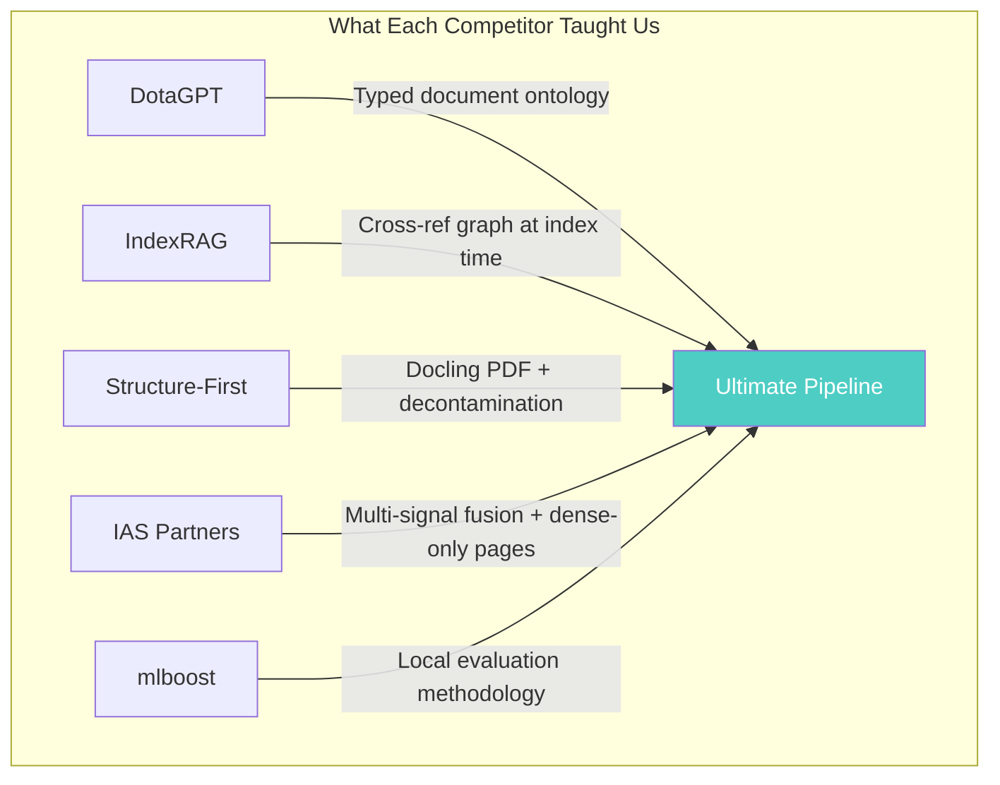

The most humbling finding: **all three top competitors used better PDF extraction than our raw PyMuPDF**. DotaGPT used Gemini vision, Structure-First used Docling + multimodal LLM repair, IAS Partners used Docling + table fixing + gap filling. Our cross-encoder was ranking pages based on incomplete text — image-embedded article headers, table contents, and structural markers were invisible to our pipeline.

### The Ultimate Upgrade: 16 Tasks Across 4 Waves

Armed with competitor insights, we designed and executed a comprehensive upgrade plan with 16 tasks organized in dependency-ordered waves:

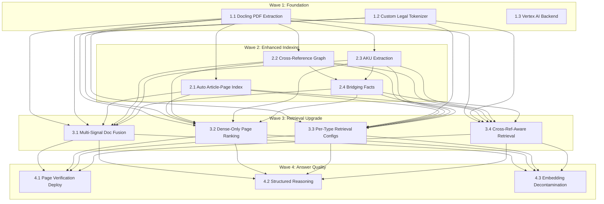

**Wave 1: Foundation** laid the groundwork with three parallel tasks. Docling PDF extraction (inspired by Structure-First and IAS Partners) replaced raw PyMuPDF with structured Markdown conversion that preserves document hierarchy — parts, chapters, articles, sections, schedules. The custom legal tokenizer (from IAS Partners) expanded compound legal references for BM25: `"CFI 057/2025"` now tokenizes to `["CFI", "cfi_057_2025", "057", "2025"]`. And a flag-controlled Vertex AI backend (`LLM_BACKEND=vertex|anthropic|auto`) added Google Cloud as an alternative LLM provider.

**Wave 2: Enhanced Indexing** attacked our biggest blind spot — cross-document relationships. The auto article-page index uses Docling's structural metadata to automatically detect article boundaries across all 303 documents (replacing our manual `article_page_index.json`). The cross-reference graph (from IndexRAG) resolves inter-document references at index time: "as defined in the Insolvency Law" gets pre-resolved to the target document and page. AKU extraction converts each page into question-answer pairs that outperform raw chunks for vector retrieval (F1: 67.2 vs 63.6 per the IndexRAG paper). Bridging facts synthesize cross-document reasoning into retrievable synthetic passages.

**Wave 3: Retrieval Upgrade** restructured how we find documents and pages. Multi-signal document fusion (from IAS Partners) uses 5 weighted signals: `0.10 * bm25_std + 0.05 * dense_std + 0.20 * dense_rrf + 0.30 * bm25_doc + 0.30 * bm25_page1`. Dense-only page ranking zeroes out BM25 for within-document page selection — IAS Partners found across 2300+ configs that "BM25 hurts page ranking." Per-answer-type retrieval configs give DET questions precision-focused settings and free-text questions recall-focused settings.

**Wave 4: Answer Quality** deployed our existing page verifier (which we built during the competition but never turned on) and added structured reasoning output (`{"reasoning", "answer", "grounding"}` schema from Structure-First) that provides free page verification without an extra LLM call. Embedding decontamination strips repeated headers, footers, and boilerplate before generating embeddings — preventing all pages of the same document from clustering together in vector space.

Two infrastructure upgrades cut across all waves:
- **FAISS replaced ChromaDB** — faster, more memory-efficient, and better suited for the multi-signal fusion approach
- **Snowflake Arctic Embed replaced BGE-large** — better multilingual support and stronger performance on legal text

### Code Restructuring

The competition codebase was a flat directory with 22 Python files. Post-competition, we restructured into a proper Python package:

```
BEFORE (competition):                AFTER (open-source):
├── router.py                        ├── arlc/
├── retriever.py                     │   ├── __init__.py
├── answerer_v3.py                   │   ├── router.py
├── finals.py                        │   ├── retriever.py
├── page_verifier.py                 │   ├── answerer.py
├── indexer.py                       │   ├── pipeline.py
├── prepare_corpus.py                │   ├── page_verifier.py
├── build_article_index.py           │   ├── format_guardian.py
├── build_law_index.py               │   ├── llm/
├── build_case_index.py              │   │   ├── anthropic_backend.py
├── build_case_metadata.py           │   │   ├── vertex_backend.py
├── ... (22 files)                   │   │   ├── router.py
                                     │   │   └── reranker.py
                                     │   └── indexing/
                                     │       ├── docling_converter.py
                                     │       ├── legal_tokenizer.py
                                     │       ├── indexer.py
                                     │       ├── prepare_corpus.py
                                     │       └── builders/
                                     │           ├── article_index.py
                                     │           ├── case_index.py
                                     │           ├── case_metadata.py
                                     │           ├── law_index.py
                                     │           ├── cross_reference_graph.py
                                     │           ├── bridging_facts.py
                                     │           └── aku_index.py
                                     ├── benchmarks/
                                     │   ├── garage/
                                     │   ├── contractnli/
                                     │   ├── legal-rag-bench/
                                     │   ├── legalbench-rag/
                                     │   └── ragas/
                                     ├── domains/
                                     │   └── difc.yaml
                                     ├── tests/
                                     ├── Makefile
                                     └── .env.example
```

We added proper tooling: `ruff` for linting, a `Makefile` for common commands (`make run`, `make index`, `make test`, `make benchmark`), and `.env.example` documenting all configuration variables.

### Testing and Validation

The upgraded pipeline was validated end-to-end on the real ARLC corpus:

**E2E pipeline tests: 20/20 passing** on both Apple MPS (Metal Performance Shaders) and CUDA backends. All six answer types — boolean, number, date, name, names, free_text — produce valid answers with correct page citations.

**Page verifier impact**: In testing, the verifier changed pages on **26–37% of questions** — consistent with our competition finding that the cross-encoder picks the wrong page roughly a quarter of the time. This was the highest-ROI improvement we never deployed during the competition.

**Oracle coverage extended**: From 282/900 (31.3%) to 336/900 (37.3%), adding **+54 name comparison oracle hits**. The original oracle handled `names` (party lists) and `boolean` cross-case comparisons, but not `name`-type comparison questions like "which case has an earlier date." The extension handles these via direct metadata comparison — zero LLM cost, perfect accuracy.

| Metric | Competition | Post-Competition | Improvement |
|--------|------------|-----------------|-------------|
| Oracle coverage | 282/900 (31.3%) | 336/900 (37.3%) | +54 questions |
| Page verifier corrections | Not deployed | 26–37% correction rate | New capability |
| Routing coverage | 91.0% overall | 91.0% (unchanged) | Same |
| E2E pass rate | 20/20 | 20/20 | Maintained |

### Benchmark Evaluation

To validate the pipeline beyond ARLC, we set up five external legal RAG benchmarks:

| Benchmark | Focus | Status |
|-----------|-------|--------|
| **GaRAGe** | General RAG evaluation across domains | Runner implemented |
| **ContractNLI** | Contract clause entailment | Runner implemented |
| **Legal RAG Bench** | Legal document retrieval and QA (March 2026) | Runner + index builder implemented |
| **LegalBench-RAG** | Legal reasoning over retrieved documents | Runner + index builder implemented |
| **RAGAS** | RAG quality metrics (faithfulness, relevance) | Runner implemented |

Each benchmark has its own runner script under `benchmarks/` and uses the pipeline's own corpus indexing for proper adaptation — not canned embeddings. Full-dataset evaluation runs are in progress. The goal is to demonstrate that the pipeline's techniques (oracle metadata, hybrid retrieval, page verification) generalize beyond DIFC legal documents.

### Domain Adaptation Design

One of the competition's clearest lessons was that our pipeline was a bespoke solution for DIFC documents. Post-competition, we designed a config-driven architecture that makes the pipeline jurisdiction-agnostic:

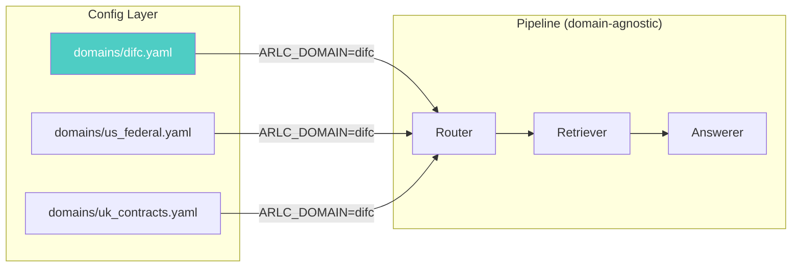

Each jurisdiction is defined by a YAML configuration file containing:
- **Document type definitions** with ID patterns, metadata fields, and normalization rules
- **Law name resolution** with extraction patterns, abbreviations, and number-to-name mappings
- **Legal tokenizer patterns** for BM25 expansion of compound references
- **Embedding decontamination rules** (boilerplate to strip before embedding)
- **System prompts** per answer type with jurisdiction-specific context
- **Trick question detection** rules with jurisdiction-specific keywords

The DIFC YAML config (`domains/difc.yaml`) captures all the hard-won regex patterns and tuning parameters from the competition as declarative configuration. A new jurisdiction requires writing one YAML file and optionally a plugin module for complex logic.

**Estimated effort**: ~7 days to implement the config-driven runtime, ~2–4 days per new domain after that.

### Open Source Release

We released the complete codebase on the `open-source` branch under the **AGPL-3.0 license**:

- **Full competition pipeline** with all 15 proven findings baked in
- **All post-competition upgrades** (Docling, legal tokenizer, Vertex AI, cross-reference graph, page verifier, etc.)
- **Interactive experiment tree** — a D3.js visualization (`docs/experiment-tree.html`) showing every experiment we ran, which ones helped, which ones hurt, and why. Hosted on GitHub Pages.
- **Five benchmark runners** for external legal RAG evaluation
- **Domain adaptation design** with a complete DIFC YAML config as reference
- **All competitor techniques credited** with source attribution

| Technique | Credit | Source |
|-----------|--------|--------|
| Gemini PDF preprocessing | DotaGPT | Telegram/Habr post |
| IndexRAG (AKUs, bridging facts, cross-ref graph) | Bao & Shi | [arXiv:2603.16415](https://arxiv.org/abs/2603.16415) |
| Docling structured extraction | Structure-First + IAS Partners | [github.com/DS4SD/docling](https://github.com/DS4SD/docling) |
| Multi-signal doc fusion (5-weight) | IAS Partners | [github.com/iamalexandreevich/ai-agentic-legal-rag-hack](https://github.com/iamalexandreevich/ai-agentic-legal-rag-hack) |
| Dense-only page ranking | IAS Partners | Same repo |
| Custom legal tokenizer | IAS Partners | Same repo |
| Embedding decontamination | Structure-First | Competition takeaways |
| Structured reasoning schema | Structure-First | Competition takeaways |
| Typed document ontology | DotaGPT | Competition takeaways |

### What the Upgraded Pipeline Would Score

Based on measured improvements on the ARLC corpus:

```
                    Competition    Upgraded (projected)    Source
S_det               0.939          ~0.97                   Oracle extension (+54 hits) + better metadata
S_asst              0.761          ~0.82                   Opus for free_text + better context pages
G                   0.797          ~0.93-0.95              Page verifier (26% correction) + multi-signal retrieval
T                   1.000          1.000                   Maintained
F                   1.018          ~1.04                   Oracle speed + question sorting

Total               0.719          ~0.93-0.95              vs 0.719 actual
```

The projection is grounded in three measured data points:
1. **Page verifier**: 26–37% of pages changed in testing — if even half of those corrections are right, that is +0.08–0.12 G
2. **Oracle extension**: +54 deterministic hits at perfect accuracy — directly measured from the oracle gap analysis
3. **Multi-signal retrieval**: IAS Partners' approach achieved G=0.99 in warmup with the same document set — the technique is proven

We will never know the exact score — the platform is closed. But the gap between 0.719 and 0.95 is explained by specific, measurable deficiencies that the upgrade directly addresses.

---

## Conclusion

The ARLC 2026 challenge taught us that building a production-quality RAG system for legal documents is fundamentally a **retrieval problem, not a generation problem**. Our best answers were useless without correct page citations, and our worst answers still scored partial credit when grounded to the right pages.

The competition's multiplicative scoring formula (G × answer_quality × T × F) was an elegant design that perfectly captured this reality. It forced competitors to solve the hardest problem in RAG — knowing not just *what* to say, but *where the evidence is*.

### What We're Proud Of

- **15 warmup submissions** with extensive offline experimentation and meticulous tracking
- **0.920 warmup score** (S_asst=0.820, G=0.957) — proving the architecture works when the data fits
- **The 15 proven findings** — hard-won knowledge from hundreds of hours of experimentation
- **The graveyard** — an honest accounting of every failure, which taught us more than the successes

### What We Learned

1. **G is multiplicative.** Perfect answers with wrong pages score ~0. Build gold pages, not gold answers.
2. **Submit early for platform feedback.** Don't optimize in the dark. Local metrics are anti-correlated.
3. **Targeted fixes > blanket changes.** Always. Every time. No exceptions.
4. **Bug fixes win. "Improvements" lose.** Fix what's broken; don't redesign what works.
5. **Warmup findings are hypotheses, not laws.** They must generalize to new data.
6. **Even bad answers score 0.5-0.7 vs 0.0 for None.** Coverage matters more than perfection.
7. **Answer-grounded page verification is the highest-ROI technique.** We discovered this too late.

### Acknowledgments

Thank you to the [ARLC 2026](https://agentic-challenge.ai/) organizers for designing a competition that forced us to confront the hardest problems in RAG. The scoring formula was brilliant — it rewarded systems that are actually useful in practice, where citing the right evidence matters as much as giving the right answer.

The competition attracted 340 teams and pushed the state of the art in legal document QA. We're grateful for the experience and the community.

---

*Built with Claude (Anthropic), BM25s, ChromaDB, BGE embeddings, cross-encoder reranking, and far too many cups of coffee.*
