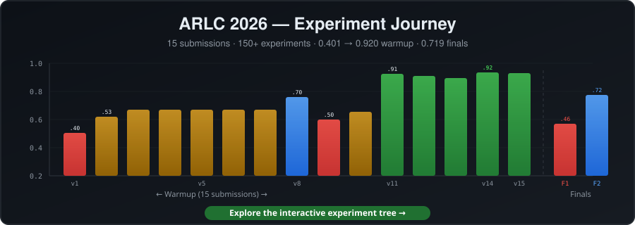

# ARLC 2026 Legal QA Pipeline

[](https://www.python.org/downloads/)
[](LICENSE)
[](https://neonsecret.github.io/ai-challenge-legal/)

A three-stage RAG pipeline for the [ARLC 2026 Agentic RAG Legal Challenge](https://agentic-challenge.ai/) — question answering over DIFC (Dubai International Financial Centre) legal documents.

<div align="center">

<a href="https://neonsecret.github.io/ai-challenge-legal/">
  
</a>

*Click the banner to explore our [interactive experiment tree](https://neonsecret.github.io/ai-challenge-legal/) — 150+ experiments, color-coded by outcome*

</div>

## Architecture

```
Question
  |
  v
Router (regex)          -- deterministic doc routing: case IDs, law names, article numbers
  |                        oracle fast-path for metadata (dates, judges, parties)
  v
Retriever               -- hybrid BM25 + dense embeddings + cross-encoder reranking
  |                        adaptive page selection (max 1 page/doc, max 3 total)
  v
Answerer                -- single Claude Sonnet call per question
  |                        type-specific prompts, confidence calibration
  v
Post-processing         -- absence detection, format validation, telemetry
  |
  v
Submission JSON
```

## Quick Start

```bash
# 1. Clone and install
git clone https://github.com/neonsecret/ai-challenge-legal.git
cd ai-challenge-legal
cp .env.example .env        # set ANTHROPIC_API_KEY and EVAL_API_KEY
uv sync                     # or: pip install -e .

# 2. Prepare corpus (downloads docs from platform API)
make prepare                # or: python -m arlc.indexing.prepare_corpus

# 3. Run pipeline
make run                    # or: python run.py --workers 5 --output output/run1
```

## Key Components

| Module | Purpose |
|--------|---------|
| `arlc/pipeline.py` | Pipeline orchestrator — routing, retrieval, answering, post-processing |
| `arlc/router.py` | Deterministic document routing via regex (no LLM) |
| `arlc/retriever.py` | Hybrid BM25 + dense vector + cross-encoder reranking |
| `arlc/answerer.py` | Answer generation via Anthropic SDK (Claude Sonnet) |
| `arlc/indexing/indexer.py` | Vector + BM25 index builder |
| `arlc/indexing/prepare_corpus.py` | End-to-end corpus download, indexing, and smoke test |
| `arlc/llm/anthropic_backend.py` | Anthropic SDK backend |
| `arlc/llm/reranker.py` | LLM-based page reranking |
| `arlc/page_verifier.py` | Page citation verification |
| `arlc/format_guardian.py` | Answer format validation and fixing |
| [`speed_agent/`](speed_agent/README.md) | **Speed pipeline** — PyPy + oracle metadata, 152ms avg TTFT |

## Data Setup

The `data/` directory is not included in the repo (copyrighted legal documents). To reproduce:

```bash
# 1. Get the ARLC starter kit
git clone https://github.com/agentic-challenge/arlc-starter-kit.git starter_kit

# 2. Download corpus and build all indexes
make prepare    # or: python -m arlc.indexing.prepare_corpus

# This creates:
#   data/documents/          — PDF corpus (303 documents)
#   data/questions.json      — question set (900 questions)
#   data/case_metadata_index.json   — case metadata (auto-built, then manually corrected)
#   data/law_name_index.json        — law name variants to doc IDs
#   data/article_page_index.json    — article number to page number
#   data/appeal_index.json          — SCT appeal classifications (manual)
#   data/consultation_paper_index.json — consultation paper metadata (manual)
#   data/court_order_index.json     — court order metadata (manual)
#   data/latest_edition_index.json  — latest edition of each law (manual)
```

> **Note**: Some indexes (appeal, consultation paper, court order) were manually curated during the competition and are generated by `prepare_corpus.py` with LLM-assisted extraction. Results may vary slightly with different API keys/models.

## Configuration

| Variable | Required | Description |
|----------|----------|-------------|
| `ANTHROPIC_API_KEY` | Yes | Anthropic API key for Claude models |
| `EVAL_API_KEY` | Yes | ARLC platform API key (corpus download) |

## Models & Acknowledgments

| Model | Provider | License | Role |
|-------|----------|---------|------|
| [Claude Sonnet 4.6](https://docs.anthropic.com/en/docs/about-claude/models) | [Anthropic](https://www.anthropic.com/) | API ToS | Answer generation (deterministic types) |
| [Claude Opus 4.6](https://docs.anthropic.com/en/docs/about-claude/models) | [Anthropic](https://www.anthropic.com/) | API ToS | Answer generation (free-text), SAC summaries |
| [Snowflake Arctic Embed L v2.0](https://huggingface.co/Snowflake/snowflake-arctic-embed-l-v2.0) | [Snowflake](https://www.snowflake.com/) | Apache 2.0 | Dense embeddings (1024d) |
| [BGE Reranker v2 M3](https://huggingface.co/BAAI/bge-reranker-v2-m3) | [BAAI](https://www.baai.ac.cn/) | MIT | Cross-encoder reranking |
| [FlashRank MiniLM L-12](https://huggingface.co/prithivida/flashrank) | [Prithivi Da](https://huggingface.co/prithivida) | Apache 2.0 | Fast initial reranking |
| [FAISS](https://github.com/facebookresearch/faiss) | [Meta Research](https://ai.meta.com/) | MIT | Vector similarity search |
| [Docling](https://github.com/DS4SD/docling) | [IBM Research](https://ds4sd.github.io/) | MIT | Structural PDF extraction |
| [PyMuPDF](https://pymupdf.readthedocs.io/) | [Artifex](https://artifex.com/) | AGPL-3.0 | PDF text extraction (fallback) |

Built with the [Anthropic API](https://docs.anthropic.com/) via [Vertex AI](https://cloud.google.com/vertex-ai).

## Development

```bash
make setup     # install dependencies
make lint      # run ruff linter
make test      # run tests
```

## Speed Agent

A separate **speed-optimized pipeline** lives in [`speed_agent/`](speed_agent/README.md). It achieves **152ms average TTFT** by:

- Answering 44% of questions via **oracle metadata lookup** (~1ms, no LLM)
- Using **PyPy** for maximum stdlib throughput (no C dependencies)
- Streaming via **Gemini Flash Lite** for remaining questions (~280ms TTFT)
- Pre-extracting all PDF text to JSON (zero I/O at inference)

See the [speed agent benchmarks](speed_agent/README.md#performance-benchmarks) for detailed performance data.

## About the Challenge

The [ARLC 2026 Agentic RAG Legal Challenge](https://agentic-challenge.ai/) tests RAG systems on real DIFC legal documents — court cases, laws, regulations, and practice directions. The scoring formula is:

```
Total = S_det x S_asst x G x F
```

Where:
- **S_det** — deterministic answer accuracy (boolean, date, number, name)
- **S_asst** — LLM-judged free-text quality
- **G** — grounding (citation accuracy)
- **F** — speed bonus (F >= 1.0 for fast responses)

## Post-Competition Upgrades

After the competition ended, we studied other participants' published approaches and integrated their best ideas into our pipeline. These upgrades were **not used in our competition submissions** — they represent what we learned from the community afterward.

| Technique | Inspired By | Description |
|-----------|------------|-------------|
| Docling PDF extraction | [Alexander Ivanov / IAS Partners](https://github.com/iamalexandreevich/ai-agentic-legal-rag-hack), [Maksim Metelskii](https://www.linkedin.com/posts/maksim-metelskii_agentic-legal-rag-challenge-activity-7441865119560601600-WuyP) | Structural PDF parsing replacing raw PyMuPDF |
| Multi-signal document fusion | [Alexander Ivanov / IAS Partners](https://github.com/iamalexandreevich/ai-agentic-legal-rag-hack) | 5-weight doc fusion, dense-only page ranking |
| Custom legal tokenizer | [Alexander Ivanov / IAS Partners](https://github.com/iamalexandreevich/ai-agentic-legal-rag-hack) | Compound legal reference expansion for BM25 |
| IndexRAG (AKU extraction, bridging facts) | [Bao & Shi, 2026](https://arxiv.org/abs/2603.16415) (Continuum AI) | QA-structured facts + cross-reference graph at index time |
| Typed document ontology | [Dmitry Savostyanov](https://t.me/savostyanov_dmitry/734) (DotaGPT agent approach) | Structural navigation instead of embedding search |
| Embedding decontamination | [Maksim Metelskii](https://www.linkedin.com/posts/maksim-metelskii_agentic-legal-rag-challenge-activity-7441865119560601600-WuyP) (structure-first methodology) | Strip boilerplate before embedding, preserve for BM25 |
| Structured reasoning with grounding | [Maksim Metelskii](https://www.linkedin.com/posts/maksim-metelskii_agentic-legal-rag-challenge-activity-7441865119560601600-WuyP) | Force LLM to cite page evidence per claim |
| Gemini PDF preprocessing | [Dmitry Savostyanov](https://t.me/savostyanov_dmitry/735) | Vision models for image-embedded structural elements |
| Evaluation tooling insights | [Dmitry Donchenko / mlboost](https://x.com/dmitry_ml/status/2036139258373616051) | Visual review UI + LLM-as-judge for batch evaluation |
| Scoring methodology insights | [Dmitry Stepanov](https://medium.com/@stepdi/building-a-legal-rag-system-lessons-from-the-arlc-2026-d3818deeb0c1) | Structured output via tool_use, reranker tradeoffs |
| Small-doc full inclusion | [Vitaliy Pokrovskiy](https://www.linkedin.com/pulse/3rd-place-out-155-teams-what-i-learned-building-rag-legal-pokrovskiy-yzuof) (3rd place) | Skip reranking for docs ≤8 pages |
| Recall-biased LLM reranker | [Azamat Yelmagambetov / CPBD](https://www.linkedin.com/pulse/how-build-so-agentic-legal-rag-system-azamat-yelmagambetov-w1fhc) (1st place, G=0.990) | "Round UP when uncertain" — F-beta(2.5) aware scoring |
| Per-type retrieval depth | [Azamat Yelmagambetov / CPBD](https://www.linkedin.com/pulse/how-build-so-agentic-legal-rag-system-azamat-yelmagambetov-w1fhc) (1st place) | 22 depth values swept per question type |
| Entity indexing at build time | [Azamat Yelmagambetov / CPBD](https://www.linkedin.com/pulse/how-build-so-agentic-legal-rag-system-azamat-yelmagambetov-w1fhc) (1st place) | Entities as separate BM25 column |
| Component-level metrics | [Azamat Yelmagambetov / CPBD](https://www.linkedin.com/pulse/how-build-so-agentic-legal-rag-system-azamat-yelmagambetov-w1fhc) (1st place) | Per-stage precision/recall instrumentation |

Thank you to all participants who shared their approaches — the open exchange of ideas after the competition made everyone's systems better.

## Benchmark Results

### ARLC 2026 Competition

| Phase | S_det | S_asst | G | T | F | Total |
|-------|-------|--------|-------|-------|-------|-------|
| Warmup (best, v14) | 0.986 | 0.820 | 0.957 | 0.995 | 1.033 | **0.920** |
| Finals (v2) | 0.939 | 0.761 | 0.797 | 1.000 | 1.018 | **0.719** |

- Oracle coverage: **37.3%** of questions answered deterministically (zero LLM calls)
- Page verifier correction rate: **26.3%** (pages corrected after answer generation)
- E2E pipeline test: **20/20** on real corpus (FAISS + Arctic Embed + Vertex AI)

### External Benchmarks

Full-dataset evaluation runs in progress. Results will be posted once complete with methodology notes for fair comparison.

Benchmarks under evaluation:
- [GaRAGe](https://github.com/amazon-science/GaRAGe) (ACL 2025) — passage-level grounding (2,366 questions)
- [ContractNLI](https://stanfordnlp.github.io/contract-nli/) — NDA entailment (607 NDAs, 10,319 pairs)
- [Legal RAG Bench](https://huggingface.co/datasets/isaacus/legal-rag-bench) — criminal law QA
- [LegalBench-RAG](https://github.com/zeroentropy-ai/legalbenchrag) — retrieval precision on contracts

## Our Journey

Read the full story of building this system — from first submission (0.401) to peak warmup (0.920) to finals (0.719) — in **[JOURNEY.md](JOURNEY.md)**.

Explore our experiments interactively in the **[Experiment Tree](docs/experiment-tree.html)** (open in browser).

## License

[AGPL-3.0](LICENSE) — Free for academic and open-source use. Commercial use requires sharing modifications under the same license. For commercial licensing inquiries, contact the author.
